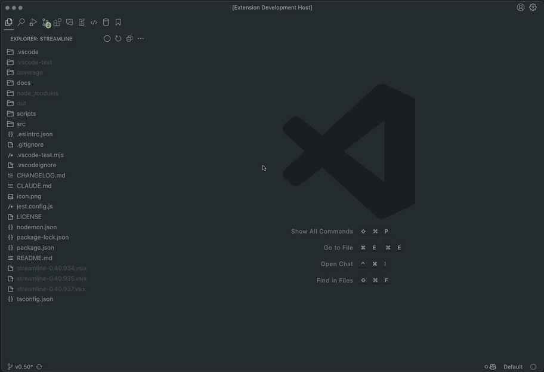
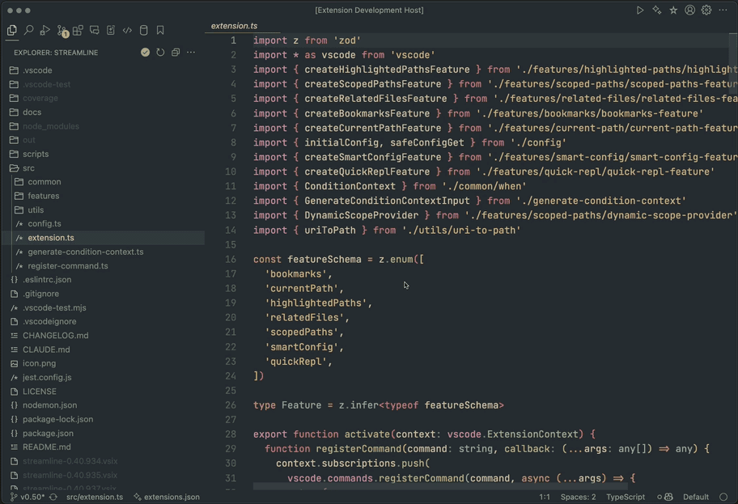
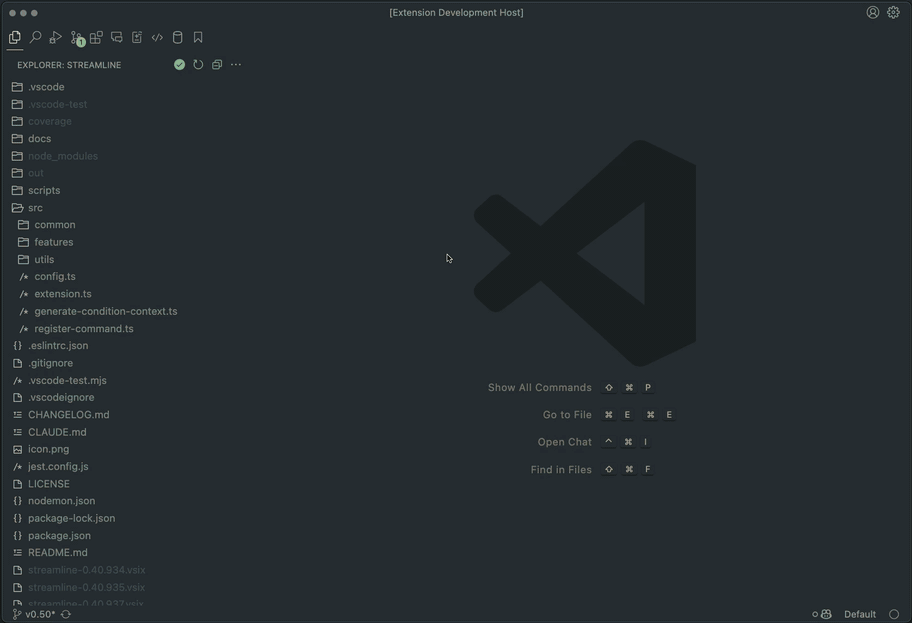
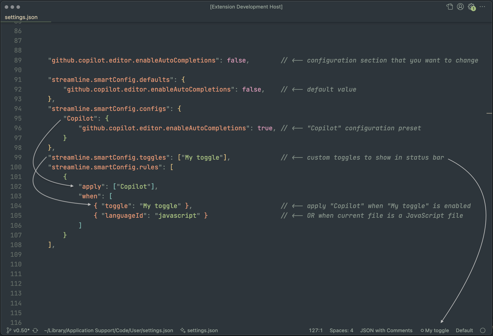
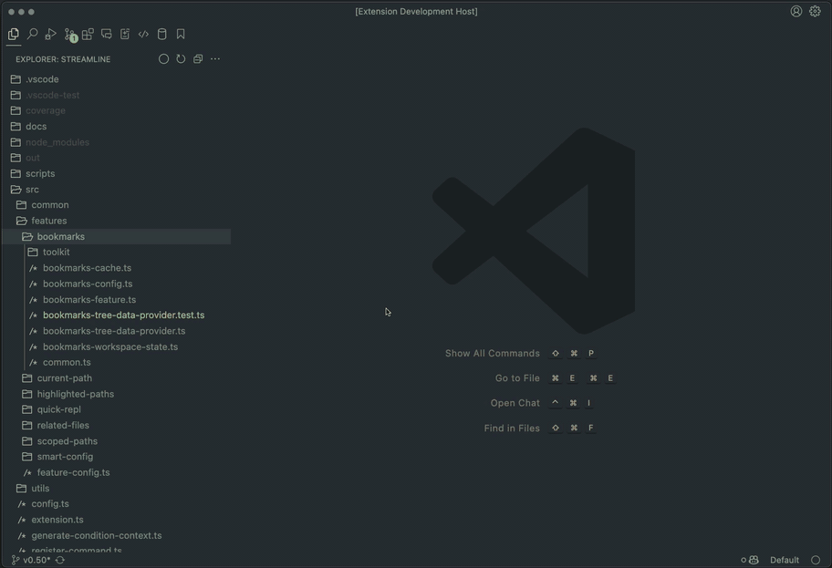

# Streamline

Productivity-oriented VS Code extension packed with features for working on large projects.

Major features:
- **Scoped Paths** – quickly scope into selected files and folders, hiding everything else
- **Bookmarks** – create bookmarks for folders, files and code selections, leave notes – and organize them into lists
- **Quick Repl** – select a playground folder to run scripts and projects using fully customizable templates and commands
- **Smart Config** – automatically apply configuration presets when certain conditions are met (for example, automatically enable Copilot in test files)

Minor features:
- **Related Files** – find and open related files, such as test files and documentation
- **Current Path** – show current path and current selection in status bar (click to copy relative path)
- **Highlighted Paths** – highlight certain files in Explorer View based on a regular expression

> Note: The extension doesn't work properly on Windows yet.

## Scoped Paths

Quickly scope into selected files and folders, hiding everything else.  
Useful in large projects and monorepos to focus on modules that you're currently working on.

> Use `Scoped Paths: Change Current Scope...` command to manage your scopes.  
> To temporarily disable Current Scope, use `Scoped Paths: Quick Unscope` command.

> When scoped, Workspace Folder is removed if it does not contain any scoped files.

> This feature is achieved by analyzing your project files and modifying `files.exclude` accordingly.
> Due to VS Code limitations in multi-folder workspaces, not all files are guaranteed to be hidden.



## Bookmarks

Create bookmarks for folders, files and code selections – and organize them into lists.  
Bookmarks can contain notes and lists can be archived.

> Use `Bookmarks: Quick Open...` to quickly open a bookmark from current list.



## Quick Repl

Select a playground folder to create scripts and projects – and run them.  
Templates and commands are fully customizable.

> Run `Quick Repl: Start Setup Wizard` command to setup Quick Repl.  
> For help, run `Quick Repl: Open Help` command.



## Smart Config

Automatically apply configuration presets when certain conditions are met (such as current path, language or color theme).  

> You can create custom toggles in the status bar to apply configuration presets manually.  
> For help, run `Smart Config: Open Help` command.



Here's a functional example for automatically enabling Copilot completions in test files or when manually toggled in status bar:
```jsonc
"streamline.smartConfig.defaults": {
    "github.copilot.editor.enableAutoCompletions": false
},
"streamline.smartConfig.configs": {
    "Copilot": { "github.copilot.editor.enableAutoCompletions": true },
},
"streamline.smartConfig.toggles": ["Copilot"],
"streamline.smartConfig.rules": [
    {
        "apply": ["Copilot"],
        "when": [
            { "basename": "\\.(test|spec|e2e-spec)\\.(c?m?jsx?|c?m?tsx?)$" },
            { "basename": "\\.(model|controller)\\.(c?m?jsx?|c?m?tsx?)$" },
            { "path": "\\/__(tests|mocks|snapshots)__\\/" },
            { "toggle": "Copilot" }
        ]
    }
]
```

## Related Files

Find and open related files to the currently opened document.  
File is considered related when it has a similar name to the current file (for example, `my.service.ts` is related to `my.service.test.ts`).  
Related files are sorted by "best match", depending on their parent folder and basename match.

> Best match is shown in status bar, and opens the related file to the side upon click.  
> All related files can be accessed with `Related Files: Quick Open...` command.



## Current Path

Show current path and current selection in status bar.  
Click to copy relative path of the currently opened document.

## Highlighted Paths

Highlight certain files in Explorer View based on a regular expression.  
Useful for highlighting tests or build files.

Configuration example for highlighting test files:
```jsonc
"streamline.highlightedPaths.patterns": [
    "\\.(test|spec|snap|mock|e2e-spec)",
    "__(tests|mocks|snapshots)__",
    "_spec\\."
]
```
