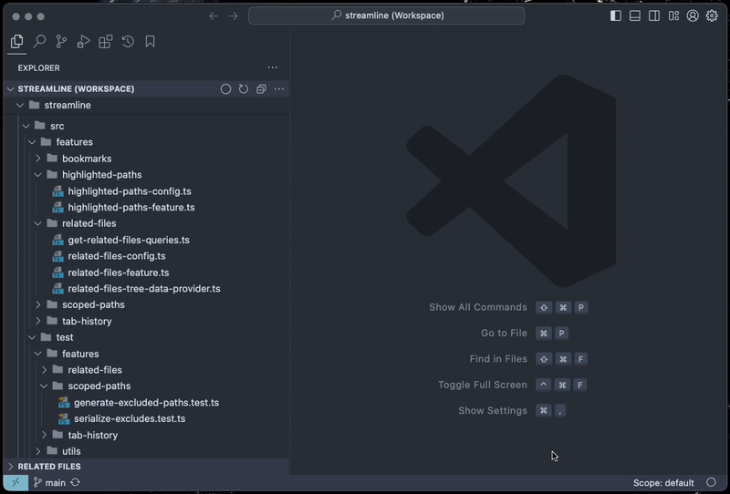
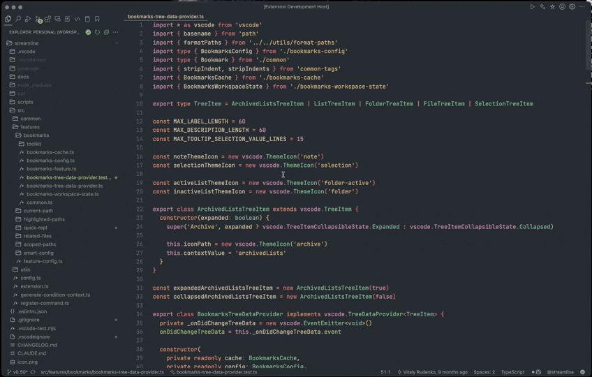
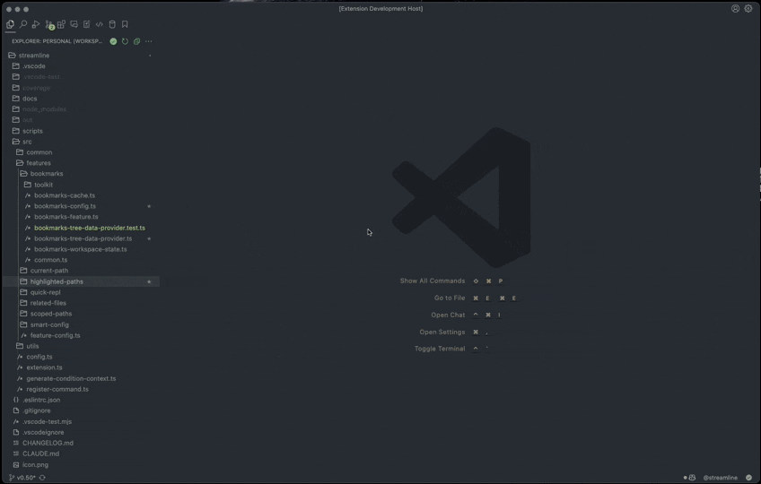
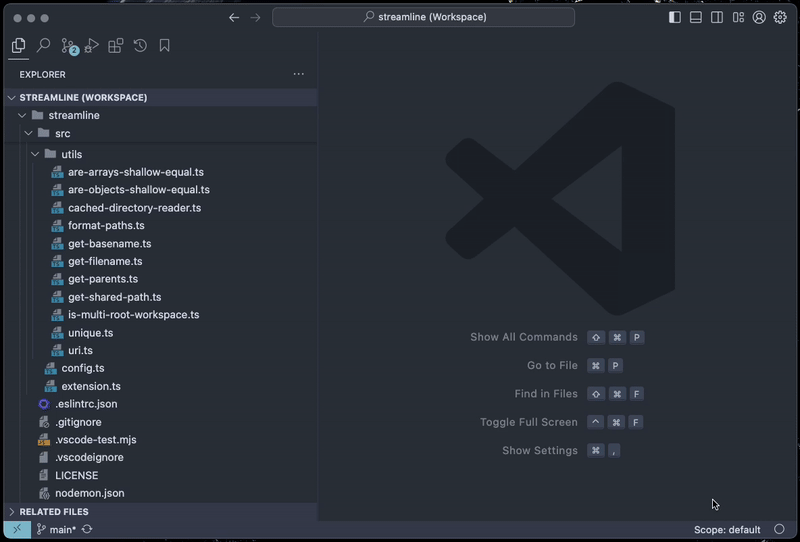

# Streamline

A productivity-oriented VS Code extension packed with features for working on large projects.

## Scoped Paths

Add files and folders into 'scopes' and easily toggle between them to only see what's important.  
Useful in large projects and monorepos to focus on modules that you're currently working on.

## Bookmarks

Bookmark folders, files and selections – and organize them into lists.

## Related files

Quickly discover potentially related files, such as tests, fixtures and components.  
Available as an Explorer view and in the Command Palette – `Quick Open Related Files`.

> Related files must have a similar name.

## Tab history

Go through your tab history to quickly find a recently opened file.  
Tabs can be pinned for easier access.

## Highlighted paths

Highlight files and folder using regular expressions by adding them into `streamline.highlightedPaths.patterns` in the workspace configuration.  
Useful for highlighting tests or build files.
