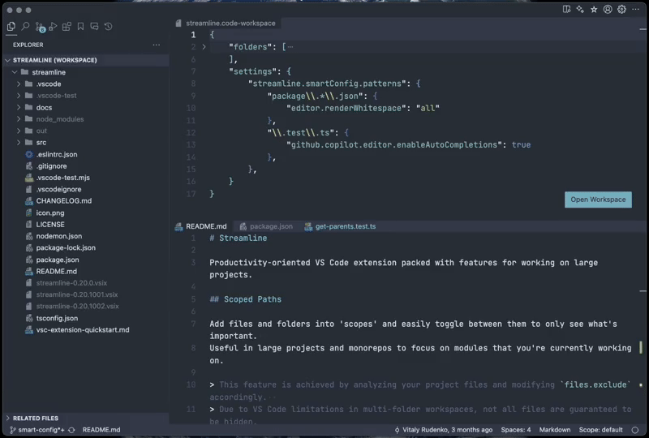

# Streamline

Productivity-oriented VS Code extension packed with features for working on large projects.

## Scoped Paths

Add files and folders into 'scopes' and easily toggle between them to only see what's important.
Useful in large projects and monorepos to focus on modules that you're currently working on.

> This feature is achieved by analyzing your project files and modifying `files.exclude` accordingly.
> Due to VS Code limitations in multi-folder workspaces, not all files are guaranteed to be hidden.

## Bookmarks

Bookmark folders, files and text  selections – and organize them into lists.
You can also add notes to your bookmarks and archive lists.

## Related Files

Quickly discover potentially related files, such as tests, fixtures and components.
Available as an Explorer view and as a command in the Command Palette (`Quick Open Related Files`).

> The extension searches for files whose basename include the current file's basename.
> Priority is given to files within the same parent folder name.
> You can also enable global search across all workspace folders, customize path rendering, and enable stricter search query in the settings.

## Smart Config

Automatically apply settings depending on current file path pattern.
For example, it can be used to only enable Github Copilot in test files.

## Highlighted Paths

Highlight files and folder using regular expressions by adding them into `streamline.highlightedPaths.patterns` in the workspace configuration.
Useful for highlighting tests or build files.

> Files are highlighted in all Explorer views, including Related Files and Bookmarks.

## Current Path

Show currently opened file path in the status bar.

> Click to temporarily toggle the visibility.
